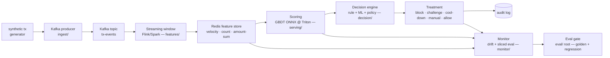

# `streaming-fraud-mini` — Streaming Fraud Detection (mini-scale)

> A greenfield, **mini-scale** streaming fraud-detection module for the AI Systems Lab. End-to-end pipeline: **synthetic tx event → Kafka ingest → streaming aggregation → Redis feature store → GBDT scoring → decision engine → treatment → drift + sliced eval → CI eval gate**.
>
> **Status:** `NOT_STARTED` — scaffold + spec only. No implementation yet. The owner implements incrementally week by week (see [Roadmap](#roadmap-implement)).

## Why this module exists

Primary day job is **Fraud/Risk ML at scale**. This module builds intuition for the *"large system"* pattern in a greenfield, public, reproducible way — without touching any employer code or data. It serves as **interview evidence**: a concrete, runnable artifact that demonstrates understanding of streaming feature engineering, online scoring, canary deployment, drift detection, and eval-gated CI.

> **Narrative anchor (private — not in public repo):** closes the *"have you built a large fraud system end-to-end?"* gap by building a small but **complete** one in public.

## Greenfield & IP boundary (non-negotiable)

- **Fresh implementation from scratch.** No code, schema, config, model, or data copied, forked, or reused from any current or former employer, or from any freelance/contract project.
- **No employer names** appear anywhere in this module. References are generic: *"Fraud/Risk ML day job"*, *"payment fraud"*, *"account-takeover (ATO)"*, *"scam"*.
- **No proprietary data.** Only synthetic generated events (see [`data/`](data/README.md)) or public datasets (e.g. Kaggle IEEE-CIS, Kaggle Credit Card Fraud) — clearly attributed.
- **Stack = open-source only:** Kafka, Flink *or* Spark Structured Streaming, Redis, Triton, FastAPI, OpenTelemetry, pytest, XGBoost/LightGBM, ONNX.
- **Design patterns are not copyrightable.** Streaming window aggregation, canary release, shadow traffic, drift alerts, eval-gated CI — these are industry patterns; implementing them in clean, original code is skill demonstration, not IP reuse.

## Architecture (mini-scale)



**Data flow (one tx):** `producer → tx-events topic → windowed aggregation (e.g. 1 min / 5 min / 1 h velocity) → Redis feature lookup → Triton score → decision policy → treatment + audit`. Monitor consumes features + scores + outcomes async; eval gate runs offline on golden scenarios in CI.

## 8-layer mapping

This module is **cross-layer** (deliberately — fraud is an end-to-end system, not a single layer):

| Lab layer | Where this module touches it | Notes |
|---|---|---|
| **L1 Model Gateway** | not used (no LLM in v1) | optional: LLM-based scam message classifier in v2 |
| **L2 Agent Runtime** | not used in v1 | optional: agent-based triage of `manual` queue in v2 |
| **L3 Knowledge** | not used | — |
| **L4 Memory** | Redis feature store (tx-history windows) | streaming feature "memory" |
| **L5 Tool System** | not used | — |
| **L6 Eval Harness** ⭐ | reuses root `eval/runner.py` + `eval/metrics.py` + `eval/golden/` | adds fraud-specific golden scenarios + recall-drop regression |
| **L7 Observability** | OpenTelemetry traces + drift dashboard | mini "Grafana for fraud" |
| **L8 Deployment** | `docker-compose` (Kafka + Redis + Triton + Flink/Spark mini) | real containers, not notebooks |

**Primary anchor: L6 + L7 + L8.** Secondary: L4.

## Stack (open-source only)

| Concern | Choice | Why |
|---|---|---|
| Streaming bus | **Apache Kafka** | industry default, mini single-broker is fine |
| Stream processing | **Apache Flink** *or* **Spark Structured Streaming** | pick one in week 2; Flink preferred for low-latency windows |
| Feature store | **Redis** (hot) | sub-ms lookup for online scoring |
| Model | **XGBoost / LightGBM** → exported **ONNX** | GBDT is the fraud workhorse; ONNX for Triton |
| Serving | **NVIDIA Triton** (ONNX backend) + **FastAPI** sidecar | Triton for batched low-latency scoring; FastAPI for non-ML decision API |
| Decision | pure Python policy engine | rule + ML + policy fusion — no framework needed |
| Observability | **OpenTelemetry** + optional Grafana/Loki | trace + metrics + logs |
| Eval / CI | **pytest** + root `eval/` harness | regression gate via `make eval` |
| Container | **Docker + docker-compose** | one-command local stack |

**No internal/proprietary tools. No employer-specific frameworks.**

## Roadmap implement (8 weeks, owner drives)

> Each week ends with: commit(s) + a short write-up note in the module's `README.md` status line. No code merges without a test or eval entry.

| Week | Deliverable | Layer | Exit criteria |
|---|---|---|---|
| **W1** | Synthetic tx event generator + Kafka producer | ingest + data | producer emits 1k events/s to local Kafka; smoke test passes |
| **W2** | Flink/Spark window aggregation → Redis feature (velocity, count, amount-sum @ 1m/5m/1h) | features | feature lookup < 5 ms; integration test asserts window correctness |
| **W3** | Train GBDT baseline (public or synthetic) → export ONNX | serving (model) | offline AUC > 0.85 on held-out; ONNX parity vs Python model within 1e-4 |
| **W4** | Triton serving + REST/gRPC endpoint + **canary** + **shadow traffic** | serving | Triton responds < 50 ms p95; canary 10% traffic; shadow log diff vs primary |
| **W5** | Decision engine (rule + ML + policy) → treatment mapping | decision | 5 treatments wired (block / challenge / cool-down / manual / allow); unit tests for policy matrix |
| **W6** | Drift detection + sliced eval by channel / amount bucket + **recall-drop alert** | monitor | PSI/KS drift on feature + score; sliced recall table; alert fires on injected drift |
| **W7** | Eval gate integration (reuse root `eval/`) + fraud golden scenarios + `baseline.json` | L6 | `make eval` runs fraud golden; regression blocks CI on recall drop > tol |
| **W8** | `docker-compose up` end-to-end + CI eval-gate green + final README + blog-post draft | L8 | one command boots full stack; CI passes; public write-up published |

> Weeks may slip with day-job load; **no skipping 2 consecutive weeks**. Even a busy week should land at least one small commit (e.g. a test, a doc tweak, a golden sample).

## Eval plan

This module **reuses the root `eval/` harness** — it does **not** fork it.

- `eval/runner.py` — regression runner; fraud module adds a `--suite fraud` mode (planned, NOT_STARTED).
- `eval/metrics.py` — common metrics; fraud adds precision/recall/F1 per slice + PSI drift (planned).
- `eval/golden/` — adds `fraud_golden.jsonl` covering **scam**, **ATO**, **payment fraud** scenarios (planned).
- `eval/baseline.json` — adds fraud baseline block (recall per slice, AUC, alert latency) (planned).

See [`eval/README.md`](eval/README.md) in this module for the benchmark plan and golden scenario taxonomy.

## Non-goals (explicit)

- ❌ **Not a production system.** No real PII, no real payment rails, no real customer impact.
- ❌ **Not millions of QPS.** Mini-scale = single-broker Kafka, single Triton instance, single Flink job. Throughput target: ~1k events/s.
- ❌ **Not a replacement for any employer system.** This exists purely for learning + public evidence.
- ❌ **No LLM agent in v1.** v2 may add an LLM-based scam-message classifier and an agent triage loop for the `manual` treatment queue — out of scope for the 8-week plan.

## Layout

```
modules/streaming-fraud-mini/
├── README.md          ← you are here (spec + architecture + roadmap)
├── spec.md            ← requirements + design decisions + IP boundary note
├── data/              ← synthetic tx event generator (spec only)
├── ingest/            ← Kafka producer (spec only)
├── features/          ← streaming aggregation → Redis (spec only)
├── serving/           ← Triton + FastAPI + canary + shadow (spec only)
├── decision/          ← rule + ML + policy → treatment (spec only)
├── monitor/           ← drift + sliced eval + recall-drop alert (spec only)
├── eval/              ← points to root eval/ + fraud golden plan (spec only)
└── tests/             ← test plan (unit + integration + smoke) (spec only)
```

Every sub-folder has its own `README.md` describing **purpose · expected interface · dependencies · status**. Implementation lands incrementally per the roadmap.

## Status

`NOT_STARTED` — scaffold + spec landed (this commit). W1 implementation pending.

## License

Inherits repo MIT license.
